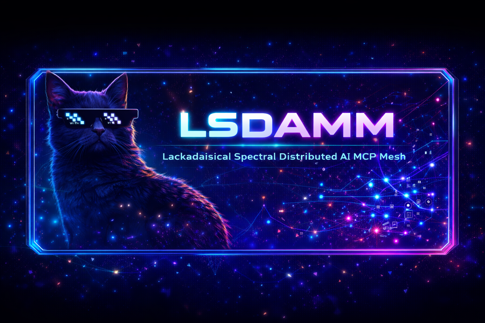

<p align="center">
   

# LSDAMM
## Lackadaisical Spectral Distributed AI MCP Mesh

[](https://github.com/Lackadaisical-Security/LSDAMM/actions/workflows/ci.yml)
[](https://opensource.org/licenses/MIT)
[](https://github.com/The-Spectral-Operator/LSDAMM/releases)

> **Phase Ω Online · Shadow Lattice Resonates**

A production-grade, cross-platform AI coordination mesh that enables seamless multi-provider AI interactions with enterprise security, persistent memory, real-time WebSocket coordination, and SWIM gossip-based mesh networking.

---

## 🌌 Features

### Multi-Provider AI Integration
- **OpenAI** - Chat Completions & Responses API (GPT-4o, GPT-5.x, o1/o3 reasoning) with **tool calling** and **vision**
- **Anthropic** - Claude Messages API (Opus 4.5, Sonnet 4.5) with **tool use**
- **Google Gemini** - Gemini 3 Pro/Flash with reasoning and vision
- **xAI Grok** - Grok 4.1 reasoning models
- **Ollama** - Local and Cloud models (Llama 3.1, Mistral, Qwen)

### Tool / Vision / Coding Capabilities
- **Tool Calling** - Function calling support via OpenAI and Anthropic with structured tool definitions
- **Vision** - Image analysis via base64-encoded attachments (OpenAI, Anthropic, Google)
- **Coding** - Capability-aware provider routing for code analysis, refactoring, and test generation
- All capabilities toggled per-message from every client (Web, Electron, VS Code)

### Intelligent Routing
- Automatic provider selection based on capabilities
- Fallback routing on provider failure
- Cost and latency optimization
- Streaming support across all providers

### Security
- JWT-based authentication
- Stripe-style API keys (`lsk_live_...`)
- Argon2 password hashing
- Rate limiting (per-IP, per-user, per-endpoint)
- CORS protection
- XSS-safe content rendering in all frontends
- CSP-compliant script loading

### Real-time Mesh Coordination
- WebSocket server for persistent connections
- Session management with heartbeat
- Message queuing for offline delivery
- Group subscriptions and broadcasts
- **Real-time stats broadcast** — server pushes telemetry (uptime, memory, client counts) every 5 seconds

### SWIM Gossip Protocol
- Full SWIM membership protocol (PING, PING-REQ, ACK, SYNC)
- Indirect probing through k-random helper peers with ACK relay
- Suspect / dead timeout transitions
- Neural handshake protocol for secure peer authentication
- Available in both the native C client and VS Code extension

### MCP Server (Model Context Protocol)
- **Universal AI app integration** — connect LSDAMM to VS Code, Claude Desktop, Claude Code, Cursor, Codex, or any MCP-compatible client
- **stdio transport** — standard MCP protocol over stdin/stdout
- **11 tools** — file I/O, shell execution, code search, mesh status, AI query routing, model listing, mesh broadcast
- **4 resources** — health, mesh status, mesh clients, available models
- **4 prompts** — mesh overview, code review, codebase explanation, multi-agent query

### Native C Tool Calling
- **7 built-in tools** — read_file, write_file, list_directory, run_command, search_files, get_system_info, mesh_status
- **MCP-compatible JSON** — tool definitions and results match the MCP protocol format
- **Cross-platform** — Win32 and POSIX implementations
- **Path sanitization** — realpath-based resolution with blocked sensitive paths
- **Command safety** — blocks dangerous shell patterns

### Cross-Platform Clients
- **Web Chatbot** - Full-featured dashboard with real-time stats, provider status, and session metrics
- **Coordination Server** - Node.js/TypeScript with stats broadcast
- **Electron Desktop** - Windows, macOS, Linux with dashboard, settings, provider/model selection
- **VS Code Extension** - Chat tab with SWIM gossip coordination, multi-agent mode, and neural handshakes
- **Native C Client** - Win32 GUI with WebSocket + SSL/TLS, settings dialog, SWIM node list, tool calling
- **MCP Server** - Model Context Protocol bridge for VS Code, Claude Desktop, Codex, and any MCP client

---

## 📁 Project Structure

```
LSDAMM/
├── server/                 # Coordination Server (TypeScript/Node.js)
│   ├── src/
│   │   ├── api/           # HTTP API endpoints (completions, attachments, mesh, health)
│   │   ├── auth/          # Authentication (JWT, API keys)
│   │   ├── db/            # SQLite database & migrations
│   │   ├── mesh/          # WebSocket server, routing, stats broadcast
│   │   ├── models/        # AI provider services (OpenAI, Anthropic, Google, xAI, Ollama)
│   │   └── util/          # Logging, config, rate limiting
│   ├── tests/             # Vitest test suite
│   ├── config/            # Configuration files
│   ├── docker/            # Docker & docker-compose
│   ├── nginx/             # Nginx reverse proxy config
│   └── systemd/           # systemd service files
├── chatbot/               # Web Chatbot (HTML/CSS/JS)
│   └── public/
│       ├── index.html     # Dashboard with real-time stats, provider status
│       ├── css/styles.css # Full production styling
│       └── js/app.js      # WebSocket client, stats, streaming, tools/vision/coding
├── electron/              # Desktop Client (Electron + Vite)
│   ├── vite.config.ts     # Vite build configuration
│   └── src/
│       ├── renderer/      # index.html + renderer.js (CSP-compliant external script)
│       └── services/      # Mesh client service
├── vscode-extension/      # VS Code Extension
│   ├── media/             # chat.js, chat.css, mesh-icon.svg
│   └── src/
│       ├── commands/      # Extension commands (review, explain, test gen, vision)
│       ├── services/      # SWIM gossip, multi-agent coordinator, mesh service
│       └── views/         # Chat panel webview
├── native/                # Native C Client
│   ├── tests/             # SWIM + tool registry tests (16 tests total)
│   └── src/
│       ├── core/          # Main entry, app state
│       ├── gui/           # Win32 GUI (settings dialog, node list, WebSocket I/O)
│       ├── mesh/          # SWIM gossip protocol (C implementation)
│       ├── network/       # WebSocket client with OpenSSL SSL/TLS
│       ├── tools/         # Tool calling system (registry, handlers, MCP JSON)
│       └── util/          # Config, logging
├── mcp-server/            # MCP Server (Model Context Protocol)
│   └── src/
│       └── index.ts       # stdio MCP server (tools, resources, prompts)
├── docs/                  # Documentation
└── infrastructure/        # Terraform, K8s, Monitoring
```

---

## 🚀 Quick Start

### Windows Users (Automated Setup)

**Recommended**: Use the automated setup script for easy installation:

1. **Download or clone the repository**:
   ```powershell
   git clone https://github.com/The-Spectral-Operator/LSDAMM.git
   cd LSDAMM
   ```

2. **Run the setup script**:
   ```powershell
   setup.bat
   ```

3. **Follow the prompts** to configure your API keys and settings

4. **Start the services**:
   ```powershell
   start-all.bat
   ```

The setup script will:
- ✅ Check for Node.js and npm
- ✅ Install all dependencies
- ✅ Set up configuration files
- ✅ Initialize the database
- ✅ Create startup scripts

### Prerequisites
- Node.js 20+
- npm or pnpm
- Docker (optional)

### Manual Server Setup (Linux/macOS/Windows)

```bash
# Clone repository
git clone https://github.com/The-Spectral-Operator/LSDAMM.git
cd LSDAMM

# Install server dependencies
cd server
npm install

# Copy and configure
cp config/server.example.toml config/server.toml
cp config/.env.example .env
# Edit .env with your API keys

# Run database migrations
npm run setup:db

# Start development server
npm run dev
```

### Docker Deployment

```bash
cd server/docker

# Configure environment
cp .env.example .env
# Edit .env with your settings

# Start all services
docker compose up -d

# View logs
docker compose logs -f coordination-server
```

### MCP Server Setup

The MCP server connects LSDAMM to any MCP-compatible AI client (VS Code, Claude Desktop, Codex, etc.):

```bash
cd mcp-server
npm install
npm run build
```

**VS Code** — add to `.vscode/mcp.json`:
```json
{
  "servers": {
    "lsdamm": {
      "command": "node",
      "args": ["mcp-server/dist/index.js"],
      "env": {
        "LSDAMM_SERVER_URL": "http://localhost:3000",
        "LSDAMM_AUTH_TOKEN": "your-token-here"
      }
    }
  }
}
```

**Claude Desktop** — add to `~/Library/Application Support/Claude/claude_desktop_config.json`:
```json
{
  "mcpServers": {
    "lsdamm": {
      "command": "node",
      "args": ["/path/to/LSDAMM/mcp-server/dist/index.js"],
      "env": { "LSDAMM_SERVER_URL": "http://localhost:3000" }
    }
  }
}
```

See [mcp-server/README.md](mcp-server/README.md) for configuration examples for Claude Code, Cursor, and Windsurf.

---

## ⚙️ Configuration

### Environment Variables

| Variable | Description | Required |
|----------|-------------|----------|
| `JWT_SECRET` | JWT signing secret | Yes |
| `OPENAI_API_KEY` | OpenAI API key | If using |
| `ANTHROPIC_API_KEY` | Anthropic API key | If using |
| `GOOGLE_API_KEY` | Google AI API key | If using |
| `XAI_API_KEY` | xAI API key | If using |
| `OLLAMA_API_KEY` | Ollama Cloud API key | If using |

### Server Configuration (TOML)

```toml
[server]
host = "0.0.0.0"
port = 3001
cors_origins = ["https://your-domain.com"]

[providers.openai]
enabled = true
default_model = "gpt-4o"

[providers.anthropic]
enabled = true
default_model = "claude-opus-4-5-20251101"

[providers.ollama_local]
enabled = true
base_url = "http://localhost:11434"
default_model = "llama3.1"
```

---

## 🔌 API Reference

### Authentication

```bash
# Register user
curl -X POST http://localhost:3001/api/users/register \
  -H "Content-Type: application/json" \
  -d '{"email":"user@example.com","password":"SecurePass123"}'

# Login
curl -X POST http://localhost:3001/api/users/login \
  -H "Content-Type: application/json" \
  -d '{"email":"user@example.com","password":"SecurePass123"}'
```

### AI Completions

```bash
# Send completion request
curl -X POST http://localhost:3001/api/completions \
  -H "Authorization: Bearer <token>" \
  -H "Content-Type: application/json" \
  -d '{
    "messages": [{"role":"user","content":"Hello, world!"}],
    "provider": "anthropic",
    "model": "claude-opus-4-5-20251101"
  }'
```

### WebSocket Connection

```javascript
const ws = new WebSocket('wss://mesh.example.com/ws');

ws.onopen = () => {
  // Register with server
  ws.send(JSON.stringify({
    messageId: crypto.randomUUID(),
    version: '1.0',
    type: 'REGISTER',
    source: { clientId: 'my-client', sessionId: 'pending' },
    timestamp: Date.now(),
    priority: 10,
    payload: { clientId: 'my-client', authToken: '...', clientType: 'web' }
  }));
};

ws.onmessage = (event) => {
  const message = JSON.parse(event.data);
  console.log('Received:', message.type, message.payload);
};
```

---

## 📊 Health & Metrics

### Health Check
```bash
curl http://localhost:3001/api/health
```

### Prometheus Metrics
```bash
curl http://localhost:3001/metrics
```

---

## 🛡️ Security Features

- **JWT Authentication** with configurable expiration
- **API Keys** with Stripe-style format and scopes
- **Argon2id** password hashing (OWASP recommended)
- **Rate Limiting** with flexible policies
- **CORS** protection with configurable origins
- **Helmet.js** security headers
- **TLS 1.2+** with certificate verification (native client SSL/TLS support)
- **Content Security Policy** — CSP-compliant external scripts in Electron
- **XSS Prevention** — HTML escaping before rendering in all frontends
- **Neural Handshake** — Challenge-response peer authentication in mesh
- **Trivy** security scanning in CI pipeline

---

## 🧪 Development

### Running Tests

```bash
# Server tests (vitest)
cd server
npm test                 # Run tests
npm run test:coverage    # With coverage

# Native C SWIM tests
cd native
gcc -std=c11 -DLINUX -D_POSIX_C_SOURCE=200809L -Isrc \
    tests/test_swim.c src/mesh/swim_gossip.c src/util/logging.c \
    -lpthread -lm -o test_swim && ./test_swim
```

### Linting

```bash
cd server
npm run lint
```

### Building

```bash
# Server
cd server
npm run build

# Electron desktop
cd electron
npm run build              # tsc + vite build

# VS Code extension
cd vscode-extension
npm run compile            # TypeScript compile

# Native client (Linux)
cd native
make                       # or: gcc -std=c11 -DLINUX ...

# Native client with SSL/TLS
cd native
make LSDAMM_USE_SSL=1      # links OpenSSL for wss:// support
```

---

## 🐳 Docker Services

The `docker-compose.yml` includes:

| Service | Port | Description |
|---------|------|-------------|
| coordination-server | 3001 | Main LSDAMM server |
| qdrant | 6333/6334 | Vector database |
| meilisearch | 7700 | Full-text search |
| ollama | 11434 | Local LLM runtime |

---

## 🚨 Troubleshooting

### Common Issues

#### Port Already in Use
If you see "EADDRINUSE" error, another process is using port 3001:

**Linux/macOS:**
```bash
# Find and kill the process
lsof -ti:3001 | xargs kill -9
```

**Windows:**
```powershell
# Find process using port
netstat -ano | findstr :3001
# Kill process (replace PID)
taskkill /PID <PID> /F
```

Or change the port in `config/server.toml`.

#### Database Errors
If database initialization fails:

```bash
cd server
rm -f data/mesh.db  # Delete existing database
npm run setup:db    # Reinitialize
```

#### Node.js Version Issues
Ensure Node.js 20+ is installed:
```bash
node --version  # Should be v20.x.x or higher
```

Update if needed from https://nodejs.org/

#### API Keys Not Working
- Verify `.env` file exists in `server/` directory
- Ensure no extra spaces around `=` signs
- Check API key format matches provider requirements
- Restart server after changing `.env`

#### WebSocket Connection Failed
- Check server is running: http://localhost:3001/api/health
- Verify firewall isn't blocking port 3001
- For remote connections, use `wss://` (secure) protocol
- Check CORS settings in `config/server.toml`

#### TypeScript Build Errors
Clean and rebuild:
```bash
cd server
rm -rf dist node_modules
npm install
npm run build
```

### Getting Help

For additional help:
- 📖 [Windows Setup Guide](docs/WINDOWS_SETUP.md)
- 📖 [API Documentation](docs/API.md)
- 🐛 [GitHub Issues](https://github.com/Lackadaisical-Security/LSDAMM/issues)
- 💬 Check server logs in `server/logs/server.log`

---

## 📜 License

MIT License - see [LICENSE](LICENSE) for details.

---

## 🤝 Contributing

1. Fork the repository
2. Create a feature branch (`git checkout -b feature/amazing-feature`)
3. Commit your changes (`git commit -m 'Add amazing feature'`)
4. Push to the branch (`git push origin feature/amazing-feature`)
5. Open a Pull Request

---

## 📞 Support

- **Documentation**: [docs/](docs/)
- **Issues**: [GitHub Issues](https://github.com/Lackadaisical-Security/LSDAMM/issues)
- **Email**: support@lackadaisical-security.com

---

<p align="center">
  <strong>🌌 LSDAMM - Phase Ω Online · Shadow Lattice Resonates 🌌</strong><br>
  © 2025 Lackadaisical Security
</p>
